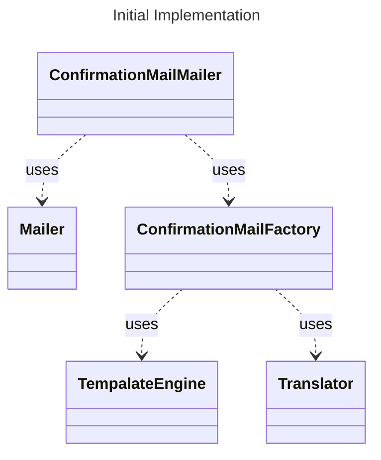

# Single Responsibility Principle (SRP)



ConfirmationMailMailer implemented as:

```rust
pub struct ConfirmationMailMailer<TE, T, M>
where
    TE: TemplatingEngine,
    T: Translator,
    M: Mailer,
{
    templating_engine: TE,
    translator: T,
    mailer: M,
}

impl<TE, T, M> ConfirmationMailMailer<TE, T, M>
where
    TE: TemplatingEngine,
    T: Translator,
    M: Mailer,
{
    pub fn new(templating_engine: TE, translator: T, mailer: M) -> Self { ... }

    pub fn send_to(&self, user: User) {
        let message = self.create_message_for(user);
        self.send_message(message);
    }

    fn create_message_for(&self, user: User) -> Message {
        let subject = self.translator.translate("Confirm your mail address");
        let template_ctx =
            HashMap::from([("confirmation_code".to_owned(), user.get_confirmation_code())]);
        let body = self
            .templating_engine
            .render("confirmation_mail.html.tpl", template_ctx);
        let mut message = Message::new(subject, body);
        message.set_to(user.get_email_address().to_owned());
        message
    }

    fn send_message(&self, message: Message) {
        self.mailer.send(message);
    }
}
```

has two responsibilities:

-   create a confirmation mail and
-   send the mail.

This violates the SRP.
