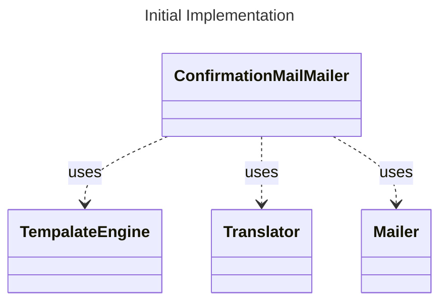

# Single Responsibility Principle (SRP)



ConfirmationMailMailer implemented as:

```rust
pub struct ConfirmationMailMailer<TE, T, M>
where
    TE: TemplatingEngine,
    T: Translator,
    M: Mailer,
{
    templating_engine: TE,
    translator: T,
    mailer: M,
}

impl<TE, T, M> ConfirmationMailMailer<TE, T, M>
where
    TE: TemplatingEngine,
    T: Translator,
    M: Mailer,
{
    pub fn new(templating_engine: TE, translator: T, mailer: M) -> Self { ... }

    pub fn send_to(&self, user: User) { ... }

    fn create_message_for(&self, user: User) -> Message { ... }

    fn send_message(&self, message: Message) { ... }
}
```

has two responsibilities:

-   create a confirmation mail and
-   send the mail.

This violates the SRP.
